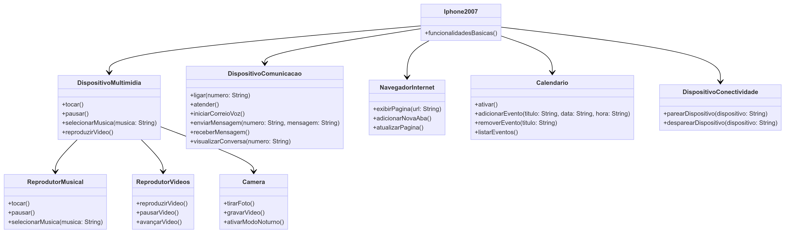

# UML-iphone
DIO Java course from Bradesco

--
classDiagram

    class Iphone2007 {
        +funcionalidadesBasicas()
    }

    class DispositivoMultimidia {
        +tocar()
        +pausar()
        +selecionarMusica(musica: String)
        +reproduzirVideo()
    }

    class ReprodutorMusical {
        +tocar()
        +pausar()
        +selecionarMusica(musica: String)
    }

    class ReprodutorVideos {
        +reproduzirVideo()
        +pausarVideo()
        +avançarVideo()
    }

    class Camera {
        +tirarFoto()
        +gravarVideo()
        +ativarModoNoturno()
    }

    class DispositivoComunicacao {
        +ligar(numero: String)
        +atender()
        +iniciarCorreioVoz()
        +enviarMensagem(numero: String, mensagem: String)
        +receberMensagem()
        +visualizarConversa(numero: String)
    }

    class NavegadorInternet {
        +exibirPagina(url: String)
        +adicionarNovaAba()
        +atualizarPagina()
    }

    class Calendario {
        +ativar()
        +adicionarEvento(titulo: String, data: String, hora: String)
        +removerEvento(titulo: String)
        +listarEventos()
    }

    class DispositivoConectividade {
        +parearDispositivo(dispositivo: String)
        +desparearDispositivo(dispositivo: String)
    }

    Iphone2007 --> DispositivoMultimidia
    Iphone2007 --> DispositivoComunicacao
    Iphone2007 --> NavegadorInternet
    DispositivoMultimidia --> ReprodutorMusical
    ´´´
    DispositivoMultimidia --> ReprodutorVideos
    DispositivoMultimidia --> Camera
    Iphone2007 --> DispositivoConectividade
        Iphone2007 --> Calendario

